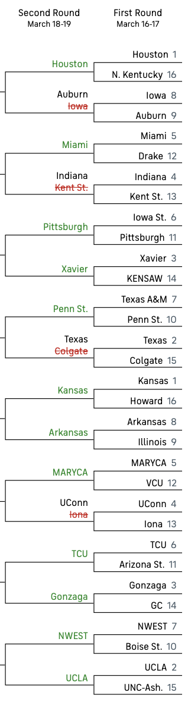

# March Madness 2023
### Can Gradient Boosting beat the average player in the ESPN Bracket Challenge round of 64 using only basic season-average team statistics from the 2023 season? 

Using a dataset of 13 season-average team statistics from 2023, gradient boosting is used to predict winners in the round of 64. These results will be compared to the average accuracy in the ESPN Bracket Challenge (Numbers not available at the moment). 

### Model Picks:

See picks with predictors -->  **Boostingr64Predictions.csv**

Data Source: https://www.kaggle.com/competitions/march-machine-learning-mania-2023/data

### Results:
The end accuracy of this model on the first round of the 2023 NCAA tournament was 59.375%. Better than a coin-flip, but not as good as the testing accuracy. 
Looking at the result, there is a clear bias towards high performing, double-digit seeds that won their conferences. While conference was a feature of the dataset, there are likely limited head-to-head matchups between top mid-major schools and schools from power 5 conferences during the regular season. This merits further consideration, but adjusting for this could be an area of improvement. 

